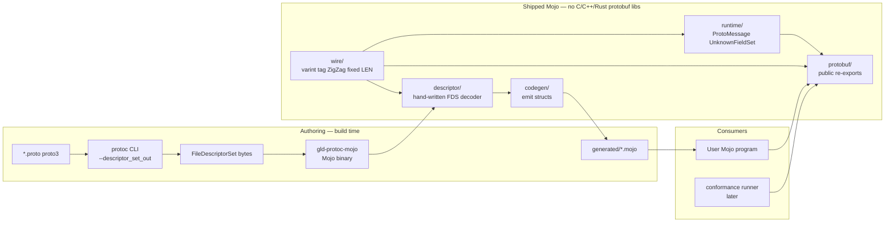
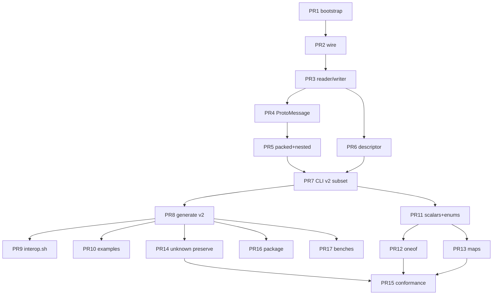

# Protocol Buffers for Mojo (`mojo-protobuf`)

| Field | Value |
| --- | --- |
| **Document title** | Protocol Buffers serializer for the Mojo programming language |
| **Author** | TBD |
| **Date** | 2026-09-05 |
| **Status** | Draft (rev 5) |
| **Target repo** | `/home/leo/PycharmProjects/GLD/gld-protobuf` (greenfield standalone library; only gitignored `temp/` scratch as of 2026-09-05) |
| **License** | MIT |
| **Recommended Mojo pin** | `mojo == 1.0.0` (stable, 2026-08-11; nightly is `1.1.0.dev*` as of 2026-09-03) |

---

## Overview

There is no production Protocol Buffers implementation for Modular Mojo as of 2026-09-05 (search, not a hard negative proof). This document specifies a **standalone, from-scratch Mojo** protobuf library for the empty `gld-protobuf` repository: four independently buildable layers (wire, descriptor, codegen, runtime), a Mojo CLI that consumes `protoc --descriptor_set_out` (not a v1 `protoc` plugin), and generated structs with explicit encode/decode. It is **not** a component of any other monorepo.

**Hard product constraint:** the shipped runtime and the codegen walker have **zero C, C++, or Rust library dependencies**. They do not wrap, link, FFI, bind, or vendor libprotobuf, protobuf-c, nanopb, protozero, upb, prost, rust-protobuf, or quick-protobuf. `protoc` is allowed only as a **build-time host CLI** that emits a `FileDescriptorSet` blob. Python `google.protobuf` is allowed only as a **test oracle** (golden vectors, interop against official implementations) and is not required to encode/decode at runtime or to run codegen once a descriptor set exists.

The first test messages (v0.1 test schema, package `benchmark.v2`) are `Message`, `Document`, `Telemetry`, `Strings`, `Event`, plus `Batch_*`. They live under this repo’s `testdata/` / `tests/` tree as ordinary unit and interop test material — not the product schema. Bytes for *known* fields must interop with official Python / Go protobuf (and other standard implementations used as oracles). Official proto3 **preserves** unknown fields; v0.1 may skip them as a milestone, which is an explicit **deviation** and must be closed in Phase 3 before claiming a general library or running official binary conformance.

---

## Background & Motivation

### Why this change is needed

Mojo 1.0 shipped on 2026-08-11 (Modular 26.5) with source stability, ownership, zero-cost traits, SIMD, C FFI, Python interop, and compile-time reflection. Mojo programs that speak protobuf today would have to wrap CPython `google.protobuf` or link libprotobuf — that measures someone else's runtime, fights Mojo ownership on every `String` / `List` crossing, and violates the no-native-library rule. This repo is a reusable Mojo codec and codegen tool.

### Current state of the repo

- Phase 0 (wire + hand-written test messages) is implemented.
- Phase 1 (`FileDescriptorSet` decoder) is implemented in `src/descriptor/`.
- Phase 2 (`gld-protoc-mojo`) is implemented in `src/codegen/`.
- Phase 3 (remaining scalars, enums, `oneof`, maps, unknown preserve default) is implemented.
- `temp/impl_plan.md` is gitignored local scratch, not a shipped artifact.
- Test message types live in `testdata/proto/`. This library does not depend on any other repository.

### Pain points this library must not inherit

- A stub that only knows the five v2 test messages (the product is a general proto3 codec).
- Any linked C/C++/Rust protobuf implementation (forbidden).
- A reflection-only encoder: Mojo reflection sees Mojo fields, not proto field numbers or `int32` vs `sint32`.
- A `.proto` text grammar parser (second parser on top of the wire codec).
- A v1 `protoc-gen-mojo` plugin whose codec is Python `google.protobuf` (product-dependency leak + the plugin I/O is easy to get wrong).

---

## Goals & Non-Goals

### Goals (v1 product, through Phase 3)

1. **100% from-scratch Mojo** encode/decode of the proto3 **binary** wire format. No C/C++/Rust protobuf libraries at runtime or in the shipped codegen binary.
2. Four independently buildable layers: `wire/`, `descriptor/`, `codegen/`, `runtime/`.
3. Codegen consumes `protoc --descriptor_set_out` (`FileDescriptorSet`). Layer 2 is a **hand-written** Mojo decoder for the descriptor subset we need. Layer 3 walks that model and emits `.mojo` with explicit `encode_to` / `merge_from` / `encoded_len`.
4. Deliverable CLI: `gld-protoc-mojo` (shells out to `protoc --descriptor_set_out`, then emits Mojo). A later optional `protoc-gen-mojo` wrapper is UX only.
5. Interop on **known** fields with official Python and Go protobuf (test oracles) and `protoc --decode`.
6. First test messages: generate and round-trip the v2 test schema (`Message`, `Document`, `Telemetry`, `Strings`, `Event`, `Batch_*`) that lives in this repo’s `testdata/`.
7. Decoder walks a `Span[Byte]`. Encoder writes into a `List[Byte]` pre-sized from `encoded_len`. Nested messages write **in place** (no per-child temp buffer). Owned `String` / `List[Byte]` on decode.
8. Proto3 implicit presence for scalars; explicit presence for singular messages (`Optional[T]`); proto3 `optional` scalars also `Optional[T]`; packed numeric repeated on encode; packed **and** unpacked on decode.
9. Typed `DecodeError` with `kind`, `offset`, and optional `field`.
10. Independently useful library. Not coupled to any other project’s harness.

### Non-goals (v1)

- proto2 (`required`, groups, extensions, proto2 `optional` defaults).
- Protobuf Editions as a first-class input (we implement proto3 behavior: implicit scalar presence, packed numeric repeated unless `[packed=false]`).
- gRPC / `service` stubs.
- ProtoJSON.
- Well-known type special codecs (`Any`, `Timestamp`, `Duration`, `Struct`, wrappers). Treat imported WKT as ordinary messages.
- A `.proto` text grammar parser.
- A v1 `protoc` plugin as the primary path.
- C/C++/Rust FFI or vendored protobuf libraries (not even as an optional path).
- GPU encode/decode.
- Reflection-driven encode of arbitrary non-generated Mojo structs.

### Later (explicitly planned)

- Optional `protoc-gen-mojo` wrapper (correct plugin I/O; still uses the Mojo descriptor walker, not Python protobuf as the codec).
- ProtoJSON; WKT special codecs; streaming pull decoder; zero-copy `StringSpan` views.
- Official `conformance_test_runner` (Phase 4).

---

## Proposed Design

### Product naming

| Surface | Name | Rationale |
| --- | --- | --- |
| Git repository | `gld-protobuf` | Already created. |
| Public Mojo import | `protobuf` | What generated code and apps write (`from protobuf import …`). Facade over `runtime` + `wire`. |
| Conda / pixi package | `mojo-protobuf` | Avoids colliding with conda-forge `protobuf`. |
| Codegen CLI | `gld-protoc-mojo` | v1 primary tool. |
| Optional later plugin | `protoc-gen-mojo` | UX wrapper around the same Mojo walker. **Not v1.** |

No Modular-Mojo protobuf library was found as of 2026-09-05 (GitHub / Modular forum / modular-community search). [`mojo-lang/protobuf`](https://github.com/mojo-lang/protobuf) is an unrelated Go stub and is not a dependency.

### Four-layer architecture

This is the repo spine (from the local scratch note `temp/impl_plan.md`, not a shipped file):

```text
gld-protobuf/
├── wire/         # Layer 1: raw wire format primitives
├── descriptor/   # Layer 2: FileDescriptorSet model (hand-decoded)
├── codegen/      # Layer 3: descriptor → generated .mojo + CLI
└── runtime/      # Layer 4: ProtoMessage trait, unknown-field store
```

Layers 1 and 2 have a bootstrap edge that is resolved **without** codegen: Layer 2 uses Layer 1 to decode `FileDescriptorProto`, which is just messages of int32 / string / repeated fields.



**Dependency rule:** generated code imports only `protobuf` (the facade). It never imports `descriptor` or `codegen`. `codegen` is a host tool, not a runtime dep. The published `.mojoc` / conda package contains `wire` + `runtime` + `protobuf` only.

### Repository layout

```text
gld-protobuf/
  pixi.toml                      # mojo==1.0.0; optional python+protobuf for tests only
  pixi.lock
  LICENSE                        # MIT
  README.md
  .gitignore                     # includes temp/
  src/
    wire/                        # Layer 1
      __init__.mojo
      types.mojo                 # WireType
      varint.mojo
      zigzag.mojo
      reader.mojo                # WireReader
      writer.mojo                # WireWriter
      size.mojo                  # encoded_len helpers
      utf8.mojo                  # String(from_utf8=) → DecodeError remap helper only
    descriptor/                  # Layer 2
      __init__.mojo
      model.mojo                 # FileDescriptorSet / File / Message / Field / Enum
      decode.mojo                # hand-written merge_from for descriptor.proto subset
    codegen/                     # Layer 3
      __init__.mojo
      names.mojo                 # reserved-name table, package → path
      emit.mojo                  # walk model → Mojo source strings
      cli.mojo                   # gld-protoc-mojo main()
    runtime/                     # Layer 4
      __init__.mojo
      error.mojo                 # DecodeError
      message.mojo               # trait ProtoMessage + encode/decode free fns
      unknown.mojo               # UnknownFieldSet (Phase 3; stub until then)
    protobuf/                    # public facade
      __init__.mojo              # re-export wire + runtime
  testdata/
    proto/
      benchmark_v2.proto         # v2 test messages (Message, Document, …)
      scalars.proto
      packed.proto
      nested.proto
      import_child.proto         # Layer 2 multi-file / public_dependency test
      import_parent.proto
    golden/                      # produced by scripts/gen_golden.py (Python oracle)
      README.md
    descriptors/                 # committed protoc --descriptor_set_out blobs for Layer 2 tests
  tests/
    test_varint.mojo
    test_zigzag.mojo
    test_tag.mojo
    test_reader_writer.mojo
    test_utf8.mojo
    test_packed.mojo
    test_roundtrip_manual.mojo
    test_descriptor.mojo
    test_codegen_names.mojo
    generated/                   # committed output of gld-protoc-mojo
      benchmark/
        v2/
          __init__.mojo
          benchmark_v2.mojo
    test_benchmark_v2.mojo
  tests_interop/                 # shell harness, not mojo-from-python
    encode_ref.py
    decode_ref.py
    interop.sh
  examples/
    encode_message.mojo
  benches/                       # added when we start measuring; not required for 0.1.0
  scripts/
    generate.sh                  # wrap gld-protoc-mojo
    check-generated.sh
    gen_golden.py                # Python oracle only
    ci-setup.sh
  conda.recipe/                  # later publish
    recipe.yaml
```

`LICENSE` is **MIT**, added in the bootstrap PR. Official Protocol Buffers is BSD-3-Clause; we do not claim the licenses match.

`temp/` is not listed. It is gitignored scratch.

### How `from protobuf import` resolves

| Context | Mechanism |
| --- | --- |
| In-repo tests / examples | `mojo test -I src …` and `mojo run -I src …`. pixi task: `test = "mojo test -I src tests"`. |
| Generated code | `from protobuf import ProtoMessage, WireWriter, WireReader, DecodeError, WireType` — requires the same `-I src` (or `MOJOPATH` including `src`). |
| Downstream git checkout | Document `mojo -I path/to/gld-protobuf/src`. |
| After `mojo precompile` / conda | `protobuf.mojoc` installed to `$PREFIX/lib/mojo/`; the compiler auto-discovers it. No `MOJOPATH` needed. |

`src/protobuf/__init__.mojo` re-exports the public surface listed in the API table. It does **not** re-export `descriptor` or `codegen`.

### Mojo 1.0 constraints that shape the design

Verified against mojolang.org 1.0.0 docs (pages dated through 2026-09-03):

| Topic | What is true in 1.0 | Design consequence |
| --- | --- | --- |
| Packages | Module = `.mojo`. Package = dir + `__init__.mojo`. `mojo precompile` emits `.mojoc`. Stdlib uses `std.` prefix. | Four layer packages + `protobuf` facade. |
| Structs / traits | No inheritance. `@fieldwise_init`. `Copyable` / `Movable` / `Defaultable` / `Equatable` / `Writable`. `TrivialRegisterPassable` replaces `@register_passable("trivial")`. | Generated messages conform to those traits plus `ProtoMessage`. |
| Origins | Documented name is `ImmOrigin`. Nightly 1.1.0.dev removed the `ImmutOrigin` alias. | All snippets use `ImmOrigin`. |
| ADTs / match | Not shipped. | Enums = `Int32` wrapper + `comptime` integer aliases. `oneof` = generated tagged struct (Phase 3). |
| Errors | One typed error per function. Single `except`. | `DecodeError` only. Comptime aliases are **integer tags**, not `String` fields. |
| Collections | `from std.collections import List, Span`. `Span` lives in `std.collections.span`, not `std.memory`. List literals construct `Array` — construct `List[T](...)` explicitly. `Optional[T]`: truthy if set; `.value()` returns a ref. | Encoder buffer `List[Byte]`. Repeated `List[T]`. Singular messages `Optional[T]`. |
| Strings | `String(from_utf8=span)` **raises** default `Error` if invalid UTF-8. `from_utf8_lossy` replaces with U+FFFD. `unsafe_from_utf8` requires valid UTF-8. | `read_string` calls `utf8.string_from_utf8`, which `try`/`except`s that `Error` and raises `DecodeError(KIND_BAD_UTF8, offset)`. Never lossy. Never `unsafe_from_utf8`. |
| SIMD / bits | `to_bits()` on SIMD. Reconstruct with `Float64(from_bits=bits)`, **not** `Float64.from_bits`. | Generated `double` encode/decode uses those two. |
| Loops | 1.0 documents `comptime for`. | Fixed-width LE writes use `comptime for i in range(8)`. |
| Integers | Proto3 `int32` negatives are 10-byte varints. Checked `Int32(UInt64)` is wrong. | Explicit `u64_to_i32` (low 32 bits) and `i32_to_u64` (sign-extend). |
| Reflection | Can list Mojo fields; cannot see proto numbers. | Codegen emits numbers. No runtime reflection codec. |
| FFI | Exists. **Forbidden** for protobuf libraries. | No `external_call` into any protobuf implementation. No optional simdutf in v1. |
| Python | `std.python` exists. | Not used on the codec path. Interop is a **shell harness** (pipes), so tests do not depend on Mojo→CPython. |
| Tooling | `pixi`, `mojo test`, `std.testing`. | Pin `mojo == 1.0.0` from `https://conda.modular.com/max`. **CI caveat:** Modular/prefix.dev may require a token or public channel access; `scripts/ci-setup.sh` documents the exact `pixi` channels and fails with a clear message if `mojo` cannot be installed. |

### Layer 1 — wire

Implement [protobuf.dev encoding](https://protobuf.dev/programming-guides/encoding/). Expected bytes in tests come from `scripts/gen_golden.py` (official Python protobuf), not from hand-derived tables — except the spec’s own examples (`150` → `96 01`, combined `08 96 01`; ZigZag table).

**Wire types.** v1 implements 0/1/2/5 and **rejects** groups (3/4). Rejection is a deliberate proto3-only choice: official parsers skip groups; we will fail any conformance case that still embeds them until a later skip-groups change.

| ID | Name | Used for | v1 |
| --- | --- | --- | --- |
| 0 | `VARINT` | int/uint/sint/bool/enum | implement |
| 1 | `I64` | fixed64, sfixed64, double | implement |
| 2 | `LEN` | string, bytes, messages, packed repeated | implement |
| 3 | `SGROUP` | deprecated groups | **reject** (`KIND_INVALID_WIRE`) |
| 4 | `EGROUP` | deprecated groups | **reject** |
| 5 | `I32` | fixed32, sfixed32, float | implement |

Tag: `(field_number << 3) | wire_type` as unsigned varint.

**Field numbers** must be in `1 .. 2^29-1` (29 bits). `read_tag` rejects `0` and any tag whose field number does not fit in 29 bits (`KIND_BAD_FIELD`).

**Varint:** 1–10 bytes, 7 payload bits + continuation. After 10 bytes, if the last byte still has the continuation bit, or if the 10th byte contributes bits above 2^64-1 (overlong high bits), raise `KIND_OVERFLOW`. Do not silently truncate.

**ZigZag** (`sint32` / `sint64`):

```text
sint32: (n << 1) ^ (n >> 31)     # >> arithmetic on signed Int32
sint64: (n << 1) ^ (n >> 63)
```

`UInt32(negative Int32)` / the shift must be a two’s-complement bitcast. Tests include `-1` and `0x80000000` / `Int32.MIN` from the spec table.

**`int32` / `int64` negatives:** sign-extend to 64-bit, then unsigned varint (always 10 bytes for negatives). That is why codegen must not emit `sint32` logic for an `int32` field.

**Fixed-width:** little-endian IEEE-754 `float`/`double`; little-endian two’s-complement for `fixed*` / `sfixed*`.

**Presence (normative):**

| Kind | Presence | Encode | Decode |
| --- | --- | --- | --- |
| Scalar (proto3 implicit, not `optional`) | implicit | omit if default (`0` / `0.0` / `false` / empty string/bytes) | last record wins; missing → default |
| Singular message | explicit | emit iff `Optional` is set, **including empty** → `tag + LEN 0` | merge into existing `Some`; construct default if `None` |
| Repeated | concatenate | numeric: one packed `LEN` unless `[packed=false]`; string/bytes/message: one `LEN` per element | accept packed **and** unpacked; append in encounter order; multiple packed spans allowed |
| Enum | implicit as `int32` | omit if `0`; write unknown values as-is | **retain unknown enumerators** as the raw `Int32`; no range check |

Worked empty-submessage example: `Document.meta = Some(DocumentMeta())` encodes as `1a 00` (field 3, `LEN`, length 0). The C suite encoder omits this; official Python does not. Our goldens follow Python.

**Unknown fields:** parsing must skip well-formed unknown records (except groups, which we reject). **Re-encoding without preservation drops them.** That is a deviation from official proto3 (“messages preserve unknown fields and include them in the serialized output”). v0.1 test messages may skip-and-drop. Phase 3 implements `UnknownFieldSet` and makes **preserve the product default**. Official binary unknown-field conformance fails until then. Do not claim modern proto3 interop before preserve ships.

**UTF-8:** proto3 `string` is UTF-8. `bytes` is opaque.

### Layer 1 / 4 public API (complete v1 surface)

All of the following is the contract generated code may call. Methods listed here are required in the PR that introduces `WireReader`/`WireWriter`; later PRs must not invent extra names without updating this table.

#### `DecodeError` (`runtime/error.mojo`)

```mojo
struct DecodeError(Copyable, ImplicitlyCopyable, Writable, Equatable):
    var kind: Int
    var offset: Int
    var field: UInt32    # 0 = not applicable

    comptime KIND_TRUNCATED = 1
    comptime KIND_OVERFLOW = 2
    comptime KIND_INVALID_WIRE = 3
    comptime KIND_BAD_UTF8 = 4
    comptime KIND_OVERSIZE = 5
    comptime KIND_BAD_FIELD = 6
    comptime KIND_DEPTH = 7
    comptime KIND_BAD_PACKED = 8    # packed LEN length not a multiple of 4/8

    fn __init__(out self, kind: Int, offset: Int, field: UInt32 = 0):
        self.kind = kind
        self.offset = offset
        self.field = field

    fn write_to(self, mut writer: Some[Writer]):
        writer.write(
            "DecodeError(kind=", self.kind, ", offset=", self.offset, ", field=", self.field, ")"
        )
```

No `String` payload on the comptime aliases (1.0 comptime constants are integer discriminants). `offset` is the reader position at failure. `field` is set when a tag was successfully read. Callers construct with `DecodeError(DecodeError.KIND_OVERSIZE, dec.position(), 4)` or `DecodeError(DecodeError.KIND_BAD_UTF8, offset)` (`field` defaults to 0).

#### `WireType`

```mojo
struct WireType(Equatable, ImplicitlyCopyable, TrivialRegisterPassable):
    var value: UInt8
    comptime VARINT = WireType(0)
    comptime I64 = WireType(1)
    comptime LEN = WireType(2)
    comptime SGROUP = WireType(3)
    comptime EGROUP = WireType(4)
    comptime I32 = WireType(5)

    fn is_implemented(self) -> Bool:
        return self.value == 0 or self.value == 1 or self.value == 2 or self.value == 5
```

#### Size helpers (`wire/size.mojo`)

| Function | Contract |
| --- | --- |
| `fn varint_len(value: UInt64) -> Int` | 1–10 |
| `fn tag_len(field: UInt32) -> Int` | `varint_len(UInt64((field << 3)))` — wire bits do not change length vs adding 0..5 |
| `fn tag_varint_len(field: UInt32, value: UInt64) -> Int` | `tag_len(field) + varint_len(value)` |
| `fn tag_fixed32_len(field: UInt32) -> Int` | `tag_len(field) + 4` |
| `fn tag_fixed64_len(field: UInt32) -> Int` | `tag_len(field) + 8` |
| `fn tag_len_len(field: UInt32, payload_len: Int) -> Int` | `tag_len(field) + varint_len(UInt64(payload_len)) + payload_len` |
| `fn i32_to_u64(v: Int32) -> UInt64` | **sign-extend** to 64-bit (proto3 `int32` negatives → 10-byte varint) |
| `fn i64_to_u64(v: Int64) -> UInt64` | bitcast / two’s-complement |
| `fn u64_to_i32(v: UInt64) -> Int32` | **low 32 bits**, two’s-complement (not a checked convert) |
| `fn u64_to_i64(v: UInt64) -> Int64` | bitcast all 64 bits |
| `fn zigzag_encode_i32(n: Int32) -> UInt32` | spec formula; tested at `-1` and `Int32.MIN` |
| `fn zigzag_decode_i32(n: UInt32) -> Int32` | inverse |
| `fn zigzag_encode_i64` / `zigzag_decode_i64` | 64-bit pair |

#### `WireWriter` (`wire/writer.mojo`)

Writes into one `List[Byte]`. `encode[T](msg)` does `WireWriter(capacity=msg.encoded_len())` — **one allocation for the output buffer**. Nested messages do **not** allocate a child `List`.

| Method | Signature | Notes |
| --- | --- | --- |
| `__init__` | `(out self, *, capacity: Int = 64)` | `List[Byte](capacity=capacity)` |
| `write_byte` | `(mut self, b: Byte)` | |
| `write_varint` | `(mut self, value: UInt64)` | |
| `write_tag` | `(mut self, field: UInt32, wire: WireType)` | |
| `write_i32_le` | `(mut self, bits: UInt32)` | 4 bytes LE |
| `write_i64_le` | `(mut self, bits: UInt64)` | 8 bytes LE; `comptime for i in range(8)` |
| `write_bytes` | `(mut self, data: Span[Byte])` | raw payload, no tag |
| `write_len_header` | `(mut self, field: UInt32, payload_len: Int)` | `write_tag(field, LEN)` + `write_varint(len)` |
| `finish` | `(deinit self) -> List[Byte]` | |

There is **no** `write_len_blob` as the nested-message path. Submessages:

```text
enc.write_len_header(field, child.encoded_len())
child.encode_to(enc)
```

`encoded_len` is recursive and allocation-free. Top-level `encode` therefore allocates once. “One allocation” means one output `List`, not “zero work.” If a caller uses `WireWriter` without pre-sizing, `List` may grow; generated `encode()` always pre-sizes.

#### `WireReader` (`wire/reader.mojo`)

```mojo
struct WireReader[origin: ImmOrigin](Movable):
    var data: Span[Byte, origin]
    var pos: Int
    var depth: Int
    var max_depth: Int
```

| Method | Signature | Errors |
| --- | --- | --- |
| `__init__` | `(out self, data: Span[Byte, origin], *, depth: Int = 0, max_depth: Int = 100)` | |
| `remaining` | `() -> Int` | |
| `position` | `() -> Int` | current `offset` |
| `read_varint` | `() raises DecodeError -> UInt64` | truncated, overflow (incl. overlong high bits) |
| `read_tag` | `() raises DecodeError -> (UInt32, WireType)` | field not in `1..2^29-1`; wire not implemented (incl. groups) |
| `read_i32_le` | `() raises DecodeError -> UInt32` | truncated |
| `read_i64_le` | `() raises DecodeError -> UInt64` | truncated |
| `read_len_span` | `() raises DecodeError -> Span[Byte, origin]` | oversize if `n > remaining` |
| `read_string` | `() raises DecodeError -> String` | oversize; UTF-8 via `utf8.string_from_utf8` |
| `read_bytes` | `() raises DecodeError -> List[Byte]` | oversize; no UTF-8 check |
| `subreader` | `(span: Span[Byte, origin]) raises DecodeError -> WireReader[origin]` | `KIND_DEPTH` if `depth+1 > max_depth` |
| `skip_field` | `(wire: WireType) raises DecodeError` | implements 0/1/2/5; groups already rejected at `read_tag` |
| `read_packed_varint` | `(mut out: List[UInt64]) raises DecodeError` | consume a `LEN` payload as concatenated varints |
| `read_packed_fixed32` | `(mut out: List[UInt32]) raises DecodeError` | `KIND_BAD_PACKED` if `len % 4 != 0` |
| `read_packed_fixed64` | `(mut out: List[UInt64]) raises DecodeError` | `KIND_BAD_PACKED` if `len % 8 != 0` |

`read_string` does **not** let `String(from_utf8=)`’s default `Error` escape (one error type per function). The only UTF-8 path is `wire/utf8.mojo`:

```mojo
# wire/utf8.mojo — remap helper; not a second validator
fn string_from_utf8[
    origin: ImmOrigin
](span: Span[Byte, origin], offset: Int, field: UInt32 = 0) raises DecodeError -> String:
    try:
        return String(from_utf8=span)
    except _:
        raise DecodeError(DecodeError.KIND_BAD_UTF8, offset, field)


# WireReader.read_string
fn read_string(mut self) raises DecodeError -> String:
    var start = self.position()
    var span = self.read_len_span()
    return string_from_utf8(span, start, 0)
```

Do not call `unsafe_from_utf8`. Do not implement a parallel UTF-8 scanner in `reader.mojo`.

Nested decode:

```text
var inner_span = dec.read_len_span()
var inner = dec.subreader(inner_span)
child.merge_from(inner)
```

Default `max_depth = 100`.

#### `ProtoMessage` trait and free functions (`runtime/message.mojo`)

The trait is named **`ProtoMessage`**, never `Message`, so a generated proto type `Message` can conform to it.

```mojo
from std.collections import List, Span

trait ProtoMessage(Copyable, Movable, Defaultable):
    fn encoded_len(self) -> Int: ...
    fn encode_to(self, mut enc: WireWriter): ...
    fn merge_from[origin: ImmOrigin](mut self, mut dec: WireReader[origin]) raises DecodeError: ...


fn encode[T: ProtoMessage](msg: T) -> List[Byte]:
    var enc = WireWriter(capacity=msg.encoded_len())
    msg.encode_to(enc)
    return enc^.finish()


fn decode[T: ProtoMessage, origin: ImmOrigin](buf: Span[Byte, origin]) raises DecodeError -> T:
    var msg = T()
    var dec = WireReader[origin](buf)
    msg.merge_from(dec)
    return msg^
```

`encode` / `encode_to` do not raise. Top-level `decode` consumes the whole span via `merge_from`’s `while remaining > 0` loop.

### Layer 2 — descriptor bootstrap

Do **not** write a `.proto` text parser. Do **not** use Python `descriptor_pb2` inside the product.

`protoc --descriptor_set_out=x.bin --include_imports -I DIR FILE.proto` writes a `FileDescriptorSet`. Layer 2 is a **hand-written** (not codegen’d) decoder for this subset of [`descriptor.proto`](https://github.com/protocolbuffers/protobuf/blob/main/src/google/protobuf/descriptor.proto).

**`descriptor.proto` is proto2.** The product codec’s packed-default story applies to *generated proto3 user messages*, not to this bootstrap. Proto2 repeated numerics default to **unpacked** (one `VARINT` / `I32` / `I64` record per element). The only packable numeric in the subset is `FileDescriptorProto.public_dependency` (field 10, `repeated int32`). Decode it as:

- unpacked: each record is wire type `VARINT` (the usual `protoc` output);
- packed: a `LEN` of concatenated varints, if it ever appears.

A decoder that assumes proto3 packed `LEN` for field 10 will drop or mis-parse import indexes as soon as `--include_imports` produces a multi-file set.

| Message | Fields we decode | Proto numbers |
| --- | --- | --- |
| `FileDescriptorSet` | `file` | 1 repeated message |
| `FileDescriptorProto` | `name`, `package`, `dependency`, `public_dependency`, `message_type`, `enum_type`, `syntax`, `edition` | 1, 2, 3, 10, 4, 5, 12, **14** |
| `DescriptorProto` | `name`, `field`, `nested_type`, `enum_type`, `oneof_decl`, `options` | 1, 2, 3, 4, 8, 7 |
| `DescriptorProto.ExtensionRange` / reserved | skip | |
| `MessageOptions` | `map_entry` | 7 bool |
| `FieldDescriptorProto` | `name`, `number`, `label`, `type`, `type_name`, `oneof_index`, `proto3_optional`, `options` | 1, 3, 4, 5, 6, 9, 17, 8 |
| `FieldOptions` | `packed` | 2 bool |
| `EnumDescriptorProto` | `name`, `value` | 1, 2 |
| `EnumValueDescriptorProto` | `name`, `number` | 1, 2 |
| `OneofDescriptorProto` | `name` | 1 |

`edition` (field 14) is decoded so we can **reject** it, not skipped as unknown. Other unknown fields inside descriptor messages are skipped (options we do not model).

**Syntax gate (hard, before emit):** every `FileDescriptorProto` we generate from must have `syntax == "proto3"`. Treat as a CLI error (non-zero, message on stderr, no output files):

- missing `syntax` (legacy proto2 default);
- `syntax == "proto2"`;
- `edition` present (any value; Editions).

Imported files that are only used for type resolution (e.g. well-known types we treat as ordinary messages later) must still pass this gate in v1 — reject the whole set if any file is not proto3.

Official `FieldDescriptorProto.Type` / `Label` integers (codegen keys off these; do not invent another numbering):

| `type` | Name | `label` | Name |
| --- | --- | --- | --- |
| 1 | `TYPE_DOUBLE` | 1 | `LABEL_OPTIONAL` |
| 2 | `TYPE_FLOAT` | 2 | `LABEL_REQUIRED` (proto2; **reject** on user fields) |
| 3 | `TYPE_INT64` | 3 | `LABEL_REPEATED` |
| 4 | `TYPE_UINT64` | | |
| 5 | `TYPE_INT32` | | |
| 6 | `TYPE_FIXED64` | | |
| 7 | `TYPE_FIXED32` | | |
| 8 | `TYPE_BOOL` | | |
| 9 | `TYPE_STRING` | | |
| 10 | `TYPE_GROUP` | | **reject** |
| 11 | `TYPE_MESSAGE` | | |
| 12 | `TYPE_BYTES` | | |
| 13 | `TYPE_UINT32` | | |
| 14 | `TYPE_ENUM` | | |
| 15 | `TYPE_SFIXED32` | | |
| 16 | `TYPE_SFIXED64` | | |
| 17 | `TYPE_SINT32` | | |
| 18 | `TYPE_SINT64` | | |

Validate Layer 2 against real `protoc --descriptor_set_out --include_imports` blobs for `benchmark_v2.proto` **and** a multi-file testdata pair (`testdata/proto/import_child.proto` imported by `import_parent.proto`) so `dependency` / `public_dependency` are non-empty. Cross-check names/numbers/labels against the Python oracle in tests (oracle only).

In-Mojo model (`descriptor/model.mojo`) is ordinary structs (`FileDesc`, `MessageDesc`, `FieldDesc`, `EnumDesc`) — not generated protobuf types.

`FieldDesc` stores enough to emit code:

| Field | Source |
| --- | --- |
| `name: String` | `FieldDescriptorProto.name` |
| `number: UInt32` | `.number` |
| `label: Int` | 1 optional, 2 required (reject), 3 repeated |
| `type: Int` | `TYPE_*` enum 1–18 |
| `type_name: String` | for message/enum |
| `oneof_index: Optional[Int]` | field 9 |
| `proto3_optional: Bool` | field 17 |
| `packed: Optional[Bool]` | `FieldOptions.packed` if present |
| `is_map: Bool` | resolved from `type_name` → message with `map_entry = true` |

**Packed decision (normative):** a repeated packable scalar (varint / I32 / I64 types, not string/bytes/message) is packed **unless** `[packed=false]` (`packed == Some(False)`). Proto3 default is packed. Codegen must honor the override.

### Layer 3 — codegen CLI

#### Invocation

```text
gld-protoc-mojo \
  --proto testdata/proto/benchmark_v2.proto \
  --proto-path testdata/proto \
  --out tests/generated \
  [--module-prefix ""] \
  [--protoc protoc] \
  [--descriptor-set x.bin] \
  [--unknown skip|preserve]
```

`--descriptor-set x.bin` and `--proto` are mutually exclusive ways to obtain the blob:

| Mode | Who runs `protoc` | When |
| --- | --- | --- |
| Default (`--proto` …) | The Mojo CLI, via `std.os.process.Process` | Interactive / `pixi run generate` |
| `--descriptor-set x.bin` | A POSIX script (`scripts/generate.sh`) | CI, or if we do not want Mojo to spawn |

**Default spawn sequence** (cite [Process](https://mojolang.org/docs/std/os/process/Process/) and [ProcessStatus](https://mojolang.org/docs/std/os/process/ProcessStatus/)): `Process.run(path, argv)` returns a `Process`; it does **not** take a shell string, does **not** capture stderr, and does **not** wait. `wait()` returns a `ProcessStatus` (`exit_code: Optional[Int]`, `term_signal: Optional[Int]`, `has_exited() -> Bool`) — **not** an `Int`. `ProcessStatus` is not `Equatable` with `Int`; `status != 0` will not compile. Spawn failure is `Process.run` raising; `wait()` only reports how the child ended (`wait()` itself raises if `waitpid` fails).

```mojo
from std.os.process import Process

# argv is a list of program arguments, not `sh -c "..."`
try:
    var proc = Process.run(protoc_bin, argv)
    var status = proc.wait()    # required: read $TMP only after wait()
except e:
    # Process.run raises if the binary cannot be spawned
    # wait() raises if waitpid fails
    # print install hint on stderr; exit 1

# Success = exited (not signaled) with code 0
if (
    not status.has_exited()
    or status.term_signal
    or status.exit_code != Optional(0)
):
    # print protoc failed / install hint on stderr; exit 1
```

`argv` is exactly: `--descriptor_set_out=$TMP`, `--include_imports`, then one `-I` per `--proto-path`, then each `--proto` path. If `Process.run` raises (missing binary), print `protoc not found; install protobuf-compiler or pass --descriptor-set` and exit 1. A set `term_signal` is failure even if `exit_code` is empty. Never read `$TMP` before `wait()`.

**`--descriptor-set` mode:** skip `Process` entirely; `FileHandle` read the given blob. `scripts/generate.sh` may `protoc --descriptor_set_out=…` (POSIX) then `gld-protoc-mojo --descriptor-set … --out …`.

Then:

1. `descriptor.decode_file_descriptor_set(span)`.
2. Apply the syntax gate (`syntax == "proto3"`, no `edition`).
3. Emit only for files listed on `--proto` (or, in `--descriptor-set` mode, files whose `name` matches `--emit NAME` / default: all proto3 files that are not `google/protobuf/*.proto`). Imports stay in the set so `type_name` can be resolved.
4. Write Mojo sources under `--out`.

The CLI default is `--unknown preserve`. `--unknown skip` prints a one-line warning that it **deviates** from official proto3.

#### Output-path algorithm (locked)

Let `pkg` be `FileDescriptorProto.package` (`a.b.c` or empty). Let `stem` be the proto filename without directory and without `.proto`. Let `prefix` be `--module-prefix` (may be empty).

```text
out_file = out_dir / prefix / pkg.replace('.', '/') / (stem + ".mojo")
```

Examples:

| Input | Output |
| --- | --- |
| `benchmark_v2.proto`, package `benchmark.v2`, `--out tests/generated` | `tests/generated/benchmark/v2/benchmark_v2.mojo` |
| same + `--module-prefix generated` | `tests/generated/generated/benchmark/v2/benchmark_v2.mojo` (do **not** also guess a prefix from the package) |
| `scalars.proto`, empty package, `--out out` | `out/scalars.mojo` |

`--module-prefix` is prepended **once**. It is not inferred from the proto package.

At every created directory, write or update `__init__.mojo` so it **re-exports all generated message and enum types** from modules in that package:

```mojo
# tests/generated/benchmark/v2/__init__.mojo
from .benchmark_v2 import (
    Message,
    BatchMessage,
    DocumentMeta,
    DocumentItem,
    Document,
    BatchDocument,
    Telemetry,
    BatchTelemetry,
    Strings,
    BatchStrings,
    EventAttr,
    Event,
    BatchEvent,
)
```

With `mojo -I tests/generated`, users write `from benchmark.v2 import Message`. That is the only advertised import. The implementation file name (`benchmark_v2.mojo`) is an artifact of “one file per `.proto`.”

#### `type_name` resolution (locked)

Official `FieldDescriptorProto.type_name` is **not** a Mojo identifier. `descriptor.proto`: if the name starts with `.` it is fully-qualified; otherwise C++-like scoping applies (search nested types of the current message, then the parent, then the file). `protoc --descriptor_set_out` for the v2 test messages emits names like `.benchmark.v2.DocumentMeta` and `.benchmark.v2.Message`.

Resolver, in order:

1. **Fully-qualified** (`type_name[0] == '.'`): strip the leading `.`, split on `.`. Find the `FileDesc` whose `package` is the **longest prefix** of that path that equals some file’s package. The remainder is the nested-type path (`DocumentMeta`, or `Outer.Inner`). Flatten the remainder by concatenating proto message names: `Outer.Inner` → Mojo `OuterInner` (same rule as emit).
2. **Relative** (no leading `.`, rare in `protoc` output but in the spec): starting at the field’s containing message, look for a nested type matching the first component; walk parents; then file-scope types; then `package + '.' + name` as if it were fully-qualified. Same flatten rule.
3. **Same file** as the message being emitted: use the Mojo name only. **No extra import.**
4. **Other file:** emit `from <defining_file.package> import MojoName` (the package import, because `__init__.mojo` re-exports). Do not import via the `.proto` stem unless the package is empty, in which case `from <stem> import MojoName`.
5. **Unresolved:** CLI error on stderr, print the raw `type_name`, exit non-zero, write no files.

Worked rows for the v2 test messages (all types live in `benchmark_v2.proto`, package `benchmark.v2`):

| Raw `type_name` | Defining type | Mojo name | Import in `benchmark_v2.mojo` |
| --- | --- | --- | --- |
| `.benchmark.v2.DocumentMeta` | file-scope `DocumentMeta` | `DocumentMeta` | none (`Document.meta: Optional[DocumentMeta]`) |
| `.benchmark.v2.DocumentItem` | file-scope `DocumentItem` | `DocumentItem` | none (`repeated DocumentItem` → `List[DocumentItem]`) |
| `.benchmark.v2.Message` | file-scope `Message` | `Message` | none (`BatchMessage.items`) |
| `.benchmark.v2.EventAttr` | file-scope `EventAttr` | `EventAttr` | none |

If `DocumentMeta` were nested as `message Document { message Meta { … } }`, the wire name would be `.benchmark.v2.Document.Meta` and the Mojo name `DocumentMeta`.

`public import` affects only whether a relative name in the importing file may resolve through the imported file. We do not re-export foreign types from our `__init__.mojo`. Cycles: proto forbids cyclic file imports; if a set still has a type cycle, emit an error.

#### Identifier mapping

1. Proto `snake_case` fields stay `snake_case`.
2. **Mojo keywords** (`struct`, `fn`, `var`, `raises`, `trait`, `from`, …): backtick-escape (`` `struct` ``).
3. **Runtime / stdlib clashes** (table below): append a single `_`.
4. Nested proto types `Outer.Inner` become Mojo `OuterInner` at module scope (Mojo has no inner-struct namespacing we will rely on). If that collides, append `_`.
5. The trait is `ProtoMessage`. A proto message named `Message` is **not** renamed.

Reserved names (deterministic rename → `Name_`):

```text
ProtoMessage WireWriter WireReader WireType DecodeError UnknownFieldSet
encode decode encoded_len encode_to merge_from
List String Optional Span Byte Dict
Int Int32 Int64 UInt32 UInt64 Float32 Float64 Bool
```

A unit test in `tests/test_codegen_names.mojo` feeds a proto with `message Encoder` / `message List` / field `var` and checks the emitted identifiers.

#### Field-emission table

| proto3 | Mojo field type | Encode | Decode |
| --- | --- | --- | --- |
| `bool` | `Bool` | omit if false; varint 0/1 | varint ≠ 0 |
| `int32` | `Int32` | omit 0; `i32_to_u64` + varint | `u64_to_i32` |
| `int64` | `Int64` | omit 0; `i64_to_u64` | `u64_to_i64` |
| `uint32` / `uint64` | `UInt32` / `UInt64` | omit 0; varint | truncate / full |
| `sint32` / `sint64` | `Int32` / `Int64` | ZigZag then varint | un-ZigZag |
| `fixed32` / `sfixed32` / `float` | `UInt32` / `Int32` / `Float32` | I32 | I32; float via `Float32(from_bits=…)` |
| `fixed64` / `sfixed64` / `double` | `UInt64` / `Int64` / `Float64` | I64; `to_bits()` | `Float64(from_bits=read_i64_le())` |
| `string` | `String` | omit empty; LEN + UTF-8 bytes | `read_string` |
| `bytes` | `List[Byte]` | omit empty | `read_bytes` |
| `enum E` | `struct E` wrapping `Int32` | omit 0; write `.value` as int32 | store raw Int32; **no range check** |
| singular `message M` | `Optional[M]` | if set: `write_len_header` + `encode_to`, even when `encoded_len==0` | `subreader` + merge-into-existing |
| `repeated` packable | `List[T]` | packed `LEN` unless `[packed=false]` | packed `LEN` **or** unpacked; append |
| `repeated` string/bytes/message | `List[T]` | one LEN per element | append; messages merge? **no** — each LEN is a new element |
| proto3 `optional T` | `Optional[T]` even for scalars | emit iff `Some` (including `Some(0)`) | set `Some` |
| `oneof` | generated tagged struct | emit the set member | last member on the wire wins |
| `map<K,V>` | `Dict[K, V]` | as `repeated MapEntry` | last key wins |

Until the corresponding Phase 3 PR, codegen **errors** (non-zero CLI exit, message on stderr) on maps, oneof, proto2 syntax, groups, extensions, services, editions. It does **not** emit partial files.

v0.1 codegen (PR that unlocks the first test messages) only needs: `bool`, `int32`, `int64`, `double`, `string`, nested messages, `repeated` string/message/double. The **runtime** Layer 1 still implements all four wire types so later scalar PRs are codegen-only.

#### Nested type declarations

`DescriptorProto.nested_type` and `enum_type` are emitted as **module-level** structs in the same `.mojo` file, named `OuterInner` as above, **before** the outer struct. Recursive messages are allowed (`Optional[Box]` / `List[Node]`).

#### Emitted method contract (every generated message)

Preamble:

```mojo
from std.collections import List, Optional, Span
from protobuf import (
    ProtoMessage,
    WireWriter,
    WireReader,
    WireType,
    DecodeError,
    encode as pb_encode,
    decode as pb_decode,
    i32_to_u64,
    u64_to_i32,
    i64_to_u64,
    u64_to_i64,
    tag_varint_len,
    tag_fixed64_len,
    tag_len_len,
)
```

Methods: zero `__init__` (defaults), `@fieldwise_init` or explicit fieldwise init, `encoded_len`, `encode_to`, `merge_from`, wrappers `encode()` / `decode()`, `write_to` for `Writable`, `Equatable` fieldwise.

### Generated test-message snippets (implementable)

`benchmark.v2.Message` — trait is `ProtoMessage`; type is `Message`.

```mojo
@fieldwise_init
struct Message(Copyable, Movable, Defaultable, Writable, Equatable, ProtoMessage):
    var f_bool: Bool
    var f_int32: Int32
    var f_int64: Int64
    var f_float64: Float64
    var f_string: String
    var f_bool_2: Bool
    var f_int32_2: Int32
    var f_string_2: String

    fn __init__(out self):
        self.f_bool = False
        self.f_int32 = 0
        self.f_int64 = 0
        self.f_float64 = 0.0
        self.f_string = String()
        self.f_bool_2 = False
        self.f_int32_2 = 0
        self.f_string_2 = String()

    fn encoded_len(self) -> Int:
        var n = 0
        if self.f_bool:
            n += tag_varint_len(1, 1)
        if self.f_int32 != 0:
            n += tag_varint_len(2, i32_to_u64(self.f_int32))
        if self.f_int64 != 0:
            n += tag_varint_len(3, i64_to_u64(self.f_int64))
        if self.f_float64 != 0.0:
            n += tag_fixed64_len(4)
        if self.f_string.byte_length() != 0:
            n += tag_len_len(5, self.f_string.byte_length())
        if self.f_bool_2:
            n += tag_varint_len(6, 1)
        if self.f_int32_2 != 0:
            n += tag_varint_len(7, i32_to_u64(self.f_int32_2))
        if self.f_string_2.byte_length() != 0:
            n += tag_len_len(8, self.f_string_2.byte_length())
        return n

    fn encode_to(self, mut enc: WireWriter):
        if self.f_bool:
            enc.write_tag(1, WireType.VARINT)
            enc.write_varint(1)
        if self.f_int32 != 0:
            enc.write_tag(2, WireType.VARINT)
            enc.write_varint(i32_to_u64(self.f_int32))
        if self.f_int64 != 0:
            enc.write_tag(3, WireType.VARINT)
            enc.write_varint(i64_to_u64(self.f_int64))
        if self.f_float64 != 0.0:
            enc.write_tag(4, WireType.I64)
            enc.write_i64_le(self.f_float64.to_bits())
        if self.f_string.byte_length() != 0:
            enc.write_len_header(5, self.f_string.byte_length())
            enc.write_bytes(self.f_string.as_bytes())
        # f_bool_2 / f_int32_2 / f_string_2 analogously

    fn merge_from[origin: ImmOrigin](mut self, mut dec: WireReader[origin]) raises DecodeError:
        while dec.remaining() > 0:
            var field, wire = dec.read_tag()
            if field == 1 and wire == WireType.VARINT:
                self.f_bool = dec.read_varint() != 0
            elif field == 2 and wire == WireType.VARINT:
                self.f_int32 = u64_to_i32(dec.read_varint())
            elif field == 3 and wire == WireType.VARINT:
                self.f_int64 = u64_to_i64(dec.read_varint())
            elif field == 4 and wire == WireType.I64:
                self.f_float64 = Float64(from_bits=dec.read_i64_le())
            elif field == 5 and wire == WireType.LEN:
                self.f_string = dec.read_string()
            elif field == 6 and wire == WireType.VARINT:
                self.f_bool_2 = dec.read_varint() != 0
            elif field == 7 and wire == WireType.VARINT:
                self.f_int32_2 = u64_to_i32(dec.read_varint())
            elif field == 8 and wire == WireType.LEN:
                self.f_string_2 = dec.read_string()
            else:
                dec.skip_field(wire)

    fn encode(self) -> List[Byte]:
        return pb_encode(self)

    @staticmethod
    fn decode[origin: ImmOrigin](buf: Span[Byte, origin]) raises DecodeError -> Self:
        return pb_decode[Self, origin](buf)
```

**Nested encode / empty present / merge** (`Document.meta: Optional[DocumentMeta]`, field 3):

```mojo
fn encode_to(self, mut enc: WireWriter):
    if self.meta:
        ref meta = self.meta.value()
        enc.write_len_header(3, meta.encoded_len())
        meta.encode_to(enc)          # LEN 0 → bytes 1a 00

fn merge_from[origin: ImmOrigin](mut self, mut dec: WireReader[origin]) raises DecodeError:
    # ...
    elif field == 3 and wire == WireType.LEN:
        var inner = dec.subreader(dec.read_len_span())
        if not self.meta:
            self.meta = DocumentMeta()
        self.meta.value().merge_from(inner)   # merge, do not replace
```

**Packed `repeated double`** (`Telemetry.values`, field 4) — encode packed; decode packed or unpacked. Official proto3 default is packed `LEN`; unpacked `I64` per element is also legal and must decode. Generated code **must** call `read_packed_fixed64` (do not inline an 8-byte loop):

```mojo
# encode
if len(self.values) != 0:
    enc.write_len_header(4, len(self.values) * 8)
    for v in self.values:
        enc.write_i64_le(v.to_bits())

# decode branch
elif field == 4 and wire == WireType.I64:
    self.values.append(Float64(from_bits=dec.read_i64_le()))
elif field == 4 and wire == WireType.LEN:
    var words = List[UInt64]()
    dec.read_packed_fixed64(words)    # KIND_BAD_PACKED if len % 8 != 0
    for w in words:
        self.values.append(Float64(from_bits=w))
```

`BatchMessage.items` is `List[Message]`; each element is `write_len_header` + `item.encode_to(enc)` (never packed).

### Optional later `protoc-gen-mojo` (not v1)

If we add a plugin wrapper, its I/O is **not** length-prefixed. Official `plugin.proto`: the entire stdin stream is one `CodeGeneratorRequest`; the entire stdout stream is one `CodeGeneratorResponse`.

```text
# plugin (optional, later) — whole stream is the message
request = CodeGeneratorRequest.FromString(sys.stdin.buffer.read())
sys.stdout.buffer.write(response.SerializeToString())
# logs only on stderr; generate only request.file_to_generate
# response.supported_features includes FEATURE_PROTO3_OPTIONAL
# fatal errors: response.error
```

That wrapper would still call the **Mojo** descriptor walker (or shell `gld-protoc-mojo` on a dumped descriptor set). It must not link libprotobuf / prost as a codec.

**Do not confuse this with conformance**, which *is* length-prefixed:

```text
# conformance_test_runner pipe — uint32 little-endian length + payload
length = uint32_le(read 4 bytes)
payload = read(length)   # ConformanceRequest
# write the same framing for ConformanceResponse
```

v1 does not implement the plugin protocol at all.

### Zero-copy and allocation

| Object | v1 | Later |
| --- | --- | --- |
| Input buffer | Borrowed `Span[Byte]` | same |
| `string` | `String(from_utf8=span)` (copy + validate) | `StringSpan[origin]` |
| `bytes` | copy into `List[Byte]` | `Span[Byte, origin]` |
| Nested encode | `encoded_len` then in-place `encode_to` | same |
| Top-level encode | one `List[Byte](capacity=encoded_len)` | streaming `Writer` |
| Unknown fields | skip-and-drop until Phase 3; then store raw tag+payload | |

No Zig-style arena in Mojo 1.0. Do not invent one in v1.

---

## API / Interface Changes

Greenfield. Public facade (`src/protobuf/__init__.mojo`):

```text
WireType
WireWriter
WireReader
DecodeError
ProtoMessage
UnknownFieldSet          # Phase 3; empty stub until then
encode[T: ProtoMessage](msg) -> List[Byte]
decode[T: ProtoMessage](buf) raises DecodeError -> T
# size / widen helpers listed in the Layer 1 table
```

CLI: `gld-protoc-mojo` as specified above.

---

## Data Model Changes

No database. On-disk artifacts:

| Artifact | Policy |
| --- | --- |
| `tests/generated/**/*.mojo` | Committed. Regenerated by `scripts/generate.sh`. CI drift check. |
| `testdata/golden/*` | Committed. Produced by `scripts/gen_golden.py` (Python oracle). |
| `testdata/descriptors/*.bin` | Committed `protoc --descriptor_set_out` blobs for Layer 2. |
| `.mojoc` | Not committed. |
| `pixi.lock` | Committed. |
| `LICENSE` | MIT, committed in PR 1. |
| `temp/` | Gitignored. Not product. |

Semver starts at `0.1.0` (v2 test messages + skip-unknown deviation). `0.2.0` requires unknown-field preservation as default.

---

## Testing Strategy

1. **Wire unit tests.** Official `150` → `96 01`; tag+value `08 96 01`. Boundaries `0`, `1`, `127`, `128`, `300`, `2^32-1`, `2^64-1`, 10-byte `int64 -1`. Reject 11-byte / overlong-high-bit varints; reject field `0` and field `≥ 2^29`. ZigZag spec table including `Int32.MIN`. Expected bytes from `gen_golden.py` (official Python oracle) wherever the spec does not already state them.

2. **Reader/writer / UTF-8 / skip.** Unknown (implemented) wire types skipped. Groups raise `KIND_INVALID_WIRE`. Invalid UTF-8 in `string` → `KIND_BAD_UTF8` with offset; same bytes as `bytes` succeed.

3. **Hand-written `ProtoMessage`** matching `benchmark.v2.Message` **before** codegen exists.

4. **Packed + nested hand-written.** Packed and unpacked `repeated double`. `Some(DocumentMeta())` → `1a 00`. Second `LEN` for field 3 merges.

5. **Layer 2.** Decode committed descriptor blobs; compare names/numbers/labels/packed to a Python-oracle dump (test-only). Include a **multi-file import** pair so `public_dependency` is a non-empty unpacked `repeated int32`. Reject blobs with missing `syntax`, `syntax != "proto3"`, or a present `edition` (field 14).

6. **Generated `benchmark.v2`.** Round-trip five types + `Batch_*`. Empty message → zero bytes. Default scalars absent. Byte-identical to official Python for goldens **if** we emit fields in field-number order (we do) **and** empty-submessage policy matches (we emit `LEN 0`).

7. **Interop shell harness** (`tests_interop/interop.sh`) — locked:
   - `encode_ref.py` reads a JSON test object on stdin, writes protobuf bytes on stdout (no length prefix).
   - `decode_ref.py` reads protobuf bytes on stdin, writes a canonical JSON dump on stdout.
   - Mojo test binary in the middle: encode → pipe to `decode_ref.py`; pipe `encode_ref.py` → Mojo decode.
   - Does **not** use `std.python`. Does **not** use plugin or conformance framing.
   - No dependency on any other local project.

8. **Official conformance (Phase 4).** `uint32` **little-endian** length + payload each way. First runner scope: **binary payload in / binary payload out** for proto3 `TestAllTypesProto3` only. Skip JSON, JSPB, text, WKT-special, proto2. Maps/oneof/unknown-preserve/proto3-optional must exist or those cases stay on a failure list. Groups will fail until we skip them.

Use `from std.testing import assert_equal, assert_raises, TestSuite`. Each file has `test_*` + `main()` running `TestSuite.discover_tests[__functions_in_module()]().run()`.

---

## Performance Targets

Compare to **Zig protobuf 5.0 / prost**, never CPython protobuf.

| Workload | Target vs prost / zig-protobuf |
| --- | --- |
| `Message` encode/decode, 8 fields set | within **2×** ns/op |
| Mostly-default `Message` | within **1.5×** |
| `Telemetry` 1k packed doubles | within **1.5×** (memcpy-class payload) |
| `Document` / `Event` ~8 children | within **2×** |
| `BatchMessage` n=100 | linear in n; **no per-item temp `List`** (in-place nested encode) |

v0.1 acceptance is correctness + interop, not these numbers.

SIMD later only: UTF-8 of long strings; packed `double` memcpy. Not varint, not skip.

---

## Alternatives Considered

### Chosen — `protoc --descriptor_set_out` + hand-written Mojo walker + explicit generated bodies

`protoc` as a host CLI produces a `FileDescriptorSet`. Layer 2 decodes it with Layer 1. Layer 3 emits prost-style methods. No plugin protocol, no `.proto` grammar, no C/C++/Rust codec, no Python protobuf in the product.

### Rejected A — C/C++/Rust FFI (libprotobuf, nanopb, protozero, upb, prost, …)

Forbidden by product requirement. Would measure the wrong language and add native deps to the shipped package.

### Rejected B — Reflection-only encode of arbitrary Mojo structs (EmberJSON)

Cannot express field numbers or `int32` vs `sint32`.

### Rejected C — Mojo-native `.proto` text grammar (gremlin)

Second parser. `FileDescriptorSet` already is the official parse result.

### Rejected D — Python `protoc-gen-mojo` as the **v1 primary** path

Avoids a grammar parser but makes Python `google.protobuf` a product dependency for the plugin codec, and the plugin stdin protocol is easy to specify wrong (whole-stream message, **not** length-prefixed). Kept only as optional later UX around the Mojo walker.

### Rejected E — Zig-style `_desc_table` + generic runtime encode

Requires comptime heterogeneous tables Mojo 1.0 does not express cleanly. Explicit bodies first.

### Rejected F — Go/Rust plugin host that links prost/libprotobuf

Violates the no-C/C++/Rust-library rule even if the emitted text is Mojo.

---

## Security & Privacy Considerations

| Threat | Severity | Mitigation |
| --- | --- | --- |
| Hostile `LEN` / oversize | High | Reject `n > remaining`. `offset` on the error. |
| Deep nesting | High | `max_depth = 100`. |
| Packed repeated expanding to a huge `List` | Medium | Later `DecodeOptions.max_message_bytes`. v1: process address space. |
| Invalid UTF-8 as `string` | Medium | `String(from_utf8=)`; never lossy. |
| Codegen of untrusted `.proto` | Low | Emitted files are data structs + encode/decode only. No `external_call`. Identifiers sanitized. |
| Supply chain | Medium | Pin `pixi.lock`. `protoc` version documented. Do not download random `protoc` binaries at runtime. Python `protobuf` is a **test extra**, not a run dep. |

No authn. Embeddable codec.

---

## Observability

- No logging on the hot path.
- `DecodeError` includes `kind`, `offset`, `field` so CI/interop failures are locatable.
- `Writable` on generated messages and on `DecodeError`.
- CI: unit tests, descriptor-blob tests, generated-code drift, `interop.sh`.
- `DecodeStats` (fields seen / unknown skipped) is later, debug-only.

---

## Rollout Plan

1. **0.1.0** — Layers 1–3 + generated `benchmark.v2` + interop.sh green on Linux x86-64. Unknown fields **skipped** (documented deviation).
2. **0.2.0** — Phase 3 complete: remaining scalars/enums, oneof, maps, **unknown preserve default**.
3. **Source consumers** — `mojo -I src`.
4. **conda / modular-community** — `mojo precompile` of `protobuf` facade. Pin `mojo-compiler`. Codegen CLI is a separate binary in the same or a `-cli` package.
5. **Conformance statement** — after 0.2.0; binary proto3 only.

**Rollback:** pin git SHA. Generated code is committed.

**CI bootstrap risk:** installing `mojo == 1.0.0` via pixi needs channel `https://conda.modular.com/max` (stable). Some Modular setups require a token. `scripts/ci-setup.sh` documents channels and fails loudly if `mojo --version` is unavailable. Do not assume a blank GitHub runner can `pixi add mojo` without that documented.

---

## Risks

| Risk | Severity | Mitigation |
| --- | --- | --- |
| Mojo 1.0 stdlib still moving | High | Pin `1.0.0`. Snippets use documented 1.0 names (`ImmOrigin`, `Span` from `std.collections`). |
| No ADTs — enums / oneof awkward | Medium | Isolate codegen for those two (impl_plan risk). |
| `protoc` required at **codegen** time | Medium | Documented. Runtime has no `protoc` need. |
| Skip-unknown deviation | High (product) | Preserve is a near-term Phase 3 PR, not a 0.2 “maybe stay skip.” |
| Descriptor subset incomplete | Medium | Validate against real `protoc` blobs; add fields when codegen needs them. |
| Modular token / pixi in CI | Medium | `ci-setup.sh` caveat. |
| Group rejection vs conformance | Low | Documented proto3-only choice. |

---

## Open Questions

1. **Whether the optional `protoc-gen-mojo` wrapper is ever worth writing.** v1 does not need it. Revisit after the CLI is stable.
2. **If Modular ships `std.protobuf` later.** Keep this project’s import name `protobuf` and document the clash.

License (MIT), proto3 `optional` scalars (`Optional[T]`), unknown-field default, output path, trait name, empty-submessage, unknown-enum, `String(from_utf8=)`, and MOJOPATH are **Key Decisions**, not open.

---

## Key Decisions

1. **100% from-scratch Mojo runtime and codegen walker.** No C/C++/Rust protobuf libraries, FFI, or vendored codecs. `protoc` is a build-time CLI only. Python `google.protobuf` is a test oracle only.
2. **Four layers:** `wire/` → `descriptor/` → `codegen/` → `runtime/`, plus a `protobuf/` facade.
3. **Primary codegen path:** `protoc --descriptor_set_out` + hand-written Layer 2 + Mojo `gld-protoc-mojo`. Not a v1 plugin. Not a `.proto` text parser.
4. **Explicit generated `encode_to` / `merge_from` / `encoded_len`.** No runtime reflection. No `_desc_table`.
5. **Trait name is `ProtoMessage`.** Generated proto `Message` keeps the name `Message`. Reserved-name table appends `_` for runtime/stdlib clashes; keywords get backticks.
6. **Output path:** `out / module_prefix / package.split('.') / stem.mojo`. `module_prefix` prepended once. `__init__.mojo` re-exports types so `from benchmark.v2 import Message` works with `-I $out`.
7. **`from protobuf import` resolves via `-I src` (dev) or `$PREFIX/lib/mojo/protobuf.mojoc` (packaged).**
8. **proto3 only.** Require `FileDescriptorProto.syntax == "proto3"`. Missing syntax, `"proto2"`, or a present `edition` (field 14) is a CLI error. Reject groups / extensions / services the same way.
9. **v0.1 codegen subset** = types used by this repo’s `testdata/proto/benchmark_v2.proto` (`bool`, `int32`, `int64`, `double`, `string`, nested messages, repeated string/message/double). **Layer 1 runtime implements all four wire types** even when codegen only emits the first test-message subset.
9a. **`type_name` resolver:** leading `.` = fully-qualified; strip, longest-prefix package match, flatten remaining path to `OuterInner`. Same-file → no import. Other-file → `from <package> import MojoName`. Unresolved → CLI error printing the raw name. Worked: `.benchmark.v2.DocumentMeta` → `DocumentMeta` in `benchmark_v2.mojo`.
9b. **Layer 2 is proto2:** decode `public_dependency` as unpacked repeated varints (also accept packed `LEN`). Official `TYPE_*` / `LABEL_*` integers. Multi-file import testdata required.
9c. **CLI obtains the descriptor blob** either by `Process.run(protoc, argv)` + `wait()` → `ProcessStatus` (`has_exited()`, `exit_code: Optional[Int]`, `term_signal: Optional[Int]`; [Process](https://mojolang.org/docs/std/os/process/Process/), [ProcessStatus](https://mojolang.org/docs/std/os/process/ProcessStatus/)) or by `--descriptor-set x.bin` (POSIX `protoc` in `scripts/generate.sh`). Success is `has_exited() and exit_code == Optional(0)` and no `term_signal`. Do not compare `ProcessStatus` to `0`.
10. **Singular messages are `Optional[T]`.** `Some(T())` encodes as `tag + LEN 0` (e.g. `1a 00` for `Document.meta`). Decode **merges** into an existing `Some`. **Proto3 `optional` scalars are also `Optional[T]`** (same representation).
11. **Unknown enumerators are retained** as raw `Int32`. No range check.
12. **Unknown fields:** skip-and-drop is a **deviation** from official proto3, allowed only as the 0.1 milestone. Phase 3 preserve becomes the **product default**; `unknown=skip` is then opt-in. Do not claim general proto3 interop until preserve ships.
13. **Packed numeric repeated on encode** unless `[packed=false]`; decode packed and unpacked.
14. **Nested encode is two-pass in place:** `write_len_header(field, child.encoded_len()); child.encode_to(enc)`. One output `List` allocation. No per-child temp buffer.
15. **UTF-8:** `wire/utf8.mojo::string_from_utf8` wraps `String(from_utf8=span)` in `try`/`except` and raises `DecodeError(KIND_BAD_UTF8, offset, field)`. Never `from_utf8_lossy` or `unsafe_from_utf8`. No second validator.
16. **`DecodeError` has `kind`, `offset`, `field`.** Integer kind tags only. Construct with `DecodeError(kind, offset, field=0)`. Packed length errors use `KIND_BAD_PACKED`.
17. **Reject overlong varints and field numbers outside `1..2^29-1`.** Reject groups (wire 3/4).
18. **Owned `String` / `List[Byte]` on decode.**
19. **Typed `DecodeError`; encode to `List[Byte]` does not raise.**
20. **Pin `mojo == 1.0.0`.** Nightly is opt-in. Snippets use `ImmOrigin`, `Equatable`, `TrivialRegisterPassable`, `from std.collections import List, Span`, `Float64(from_bits=…)`, `comptime for`.
21. **Interop is a shell harness** against official Python/Go protobuf oracles (pipes; no length prefix). Conformance (later) is **uint32 LE** length + payload.
22. **`benchmark.v2` test messages live in this repo’s `testdata/`.** They are ordinary test data types, not the library schema and not a dependency on any other project.
23. **This library is standalone.** It is not a suite language, first consumer, or Phase deliverable of any other repository.
24. **License is MIT.** `LICENSE` is added in the bootstrap PR.

---

## References

### Local scratch (not product)

- `/home/leo/PycharmProjects/GLD/gld-protobuf/temp/impl_plan.md` — architecture/phasing input. Gitignored.

### Mojo 1.0

- [Modules and packages](https://mojolang.org/docs/manual/packages/), [Packaging](https://mojolang.org/docs/tools/packaging/), [Errors](https://mojolang.org/docs/manual/errors/), [Testing](https://mojolang.org/docs/tools/testing/)
- [List](https://mojolang.org/docs/std/collections/list/List/), [Span](https://mojolang.org/docs/std/collections/span/Span/) (`from std.collections import List, Span`)
- [String](https://mojolang.org/docs/std/collections/string/string/String/) — `String(from_utf8=)`
- [Process](https://mojolang.org/docs/std/os/process/Process/) — `Process.run` + `wait() -> ProcessStatus`
- [ProcessStatus](https://mojolang.org/docs/std/os/process/ProcessStatus/) — `exit_code: Optional[Int]`, `term_signal: Optional[Int]`, `has_exited()`
- [SIMD](https://docs.modular.com/mojo/std/builtin/simd/SIMD/) — `to_bits` / `from_bits=`
- [Types / Optional](https://mojolang.org/docs/manual/types/) — `opt.value()`
- [value traits](https://mojolang.org/docs/std/builtin/value/) — `TrivialRegisterPassable`
- [Mojo 1.0.0 notes](https://mojolang.org/releases/v1.0.0/) — `ImmOrigin`

### Protocol Buffers

- [Encoding](https://protobuf.dev/programming-guides/encoding/)
- [Proto3 language guide](https://developers.google.com/protocol-buffers/docs/proto3) — unknown fields are **preserved** by official libraries
- [descriptor.proto](https://github.com/protocolbuffers/protobuf/blob/main/src/google/protobuf/descriptor.proto)
- [plugin.proto](https://github.com/protocolbuffers/protobuf/blob/main/src/google/protobuf/compiler/plugin.proto) — whole-stream request/response (optional later wrapper only)
- [conformance/](https://github.com/protocolbuffers/protobuf/tree/master/conformance) — uint32 LE framed

### Negative result (as of 2026-09-05)

- Search of GitHub, Modular forum, modular-community found no Modular-Mojo protobuf implementation. `mojo-lang/protobuf` is an unrelated Go stub. This is a search result, not a proof that none exists.

---

## PR Plan

PRs land in `/home/leo/PycharmProjects/GLD/gld-protobuf` unless noted. Each is independently reviewable. Phases follow the four-layer plan.

### Phase 0 — wire

#### PR 1 — Repo bootstrap

- **Title:** `chore: bootstrap four-layer pixi project`
- **Files:** `pixi.toml`, `pixi.lock`, `LICENSE` (MIT), `README.md` (scope, no-C/C++/Rust-deps, `protoc` is codegen-only), `.gitignore` (`temp/`), empty `src/{wire,descriptor,codegen,runtime,protobuf}/__init__.mojo`, `scripts/ci-setup.sh` (channels + token caveat).
- **Depends on:** none.
- **Changes:** Pin `mojo == 1.0.0`. pixi task `test = "mojo test -I src tests"`. Placeholder test that imports `protobuf`.

#### PR 2 — Wire primitives + Python goldens

- **Title:** `feat(wire): varint, zigzag, tags, field-number checks`
- **Files:** `src/wire/{types,varint,zigzag}.mojo`, `tests/test_{varint,zigzag,tag}.mojo`, `scripts/gen_golden.py`, `testdata/golden/` (`08 96 01` and varint table from the oracle).
- **Depends on:** PR 1.
- **Changes:** Reject overlong varints and field numbers outside `1..2^29-1`. Official `150` vector. ZigZag tests for `-1` and `Int32.MIN`.

#### PR 3 — `WireReader` / `WireWriter` + size helpers

- **Title:** `feat(wire): WireReader, WireWriter, size helpers, UTF-8`
- **Files:** `src/wire/{reader,writer,size,utf8}.mojo`, `src/runtime/error.mojo`, `tests/test_reader_writer.mojo`, `tests/test_utf8.mojo`.
- **Depends on:** PR 2.
- **Changes:** `struct WireReader[origin: ImmOrigin]`. Full API table (`read_i32_le`/`read_i64_le`/`read_string` via `utf8.string_from_utf8` remap, `read_bytes`/`read_len_span`/`subreader`/`skip_field`/`read_packed_fixed64` → `KIND_BAD_PACKED`, `write_len_header`, `i32_to_u64` / `u64_to_i32`, `DecodeError(kind, offset, field=0)`, `max_depth`).

#### PR 4 — `ProtoMessage` + hand-written Message look-alike

- **Title:** `feat(runtime): ProtoMessage trait and manual Message test type`
- **Files:** `src/runtime/message.mojo`, `src/protobuf/__init__.mojo`, `tests/test_roundtrip_manual.mojo`, goldens for a populated `Message`.
- **Depends on:** PR 3.
- **Changes:** Trait + `encode`/`decode`. Human-written struct matching `benchmark.v2.Message`. Byte-compare to official Python golden (oracle).

#### PR 5 — Packed repeated + nested (still hand-written)

- **Title:** `feat(wire): packed repeated and in-place nested encode`
- **Files:** packed helpers if not already in PR 3, `tests/test_packed.mojo`, hand-written `Telemetry` / `Document` tests including `1a 00` and merge-into-existing.
- **Depends on:** PR 4.
- **Changes:** Packed encode; packed+unpacked decode; `write_len_header` + `encode_to`; empty present submessage.

### Phase 1 — descriptor

#### PR 6 — Hand-written `FileDescriptorSet` decoder

- **Status:** implemented (this PR)
- **Title:** `feat(descriptor): bootstrap-decode FileDescriptorSet`
- **Files:** `src/descriptor/{model,decode}.mojo`, `tests/test_descriptor.mojo`, `testdata/descriptors/*.bin` (from `protoc --descriptor_set_out --include_imports`).
- **Depends on:** PR 3 (only needs Layer 1; can overlap PR 4–5).
- **Changes:** Subset table in Layer 2. Proto2 unpacked decode of `public_dependency`. Decode `edition` (field 14) in order to reject it. Official `TYPE_*` / `LABEL_*` tables. Syntax gate. Multi-file import testdata so `public_dependency` is non-empty. Compare to Python-oracle descriptor dump in tests.

### Phase 2 — codegen

#### PR 7 — `gld-protoc-mojo` for the v2 type set

- **Status:** implemented (Phase 2 PR)
- **Title:** `feat(codegen): emit Mojo for proto3 messages used by benchmark.v2`
- **Files:** `src/codegen/{names,emit,cli}.mojo`, `tests/test_codegen_names.mojo`, `scripts/generate.sh`.
- **Depends on:** PR 5, PR 6.
- **Changes:** CLI obtains FDS via `Process.run` + `wait()` **or** `--descriptor-set`. `type_name` resolver (`.benchmark.v2.DocumentMeta` → `DocumentMeta`). Output-path algorithm. Reserved-name table. Emits `bool`/`int32`/`int64`/`double`/`string`, nested messages, repeated string/message/double (`read_packed_fixed64`). **Rejects** other scalars, maps, oneof, proto2, services — loudly. `--unknown skip` only (deviation warning).

#### PR 8 — Generate `benchmark.v2` (0.1.0 test-message gate)

- **Status:** implemented (Phase 2 PR)
- **Title:** `feat: generate benchmark.v2 test messages and pass round-trips`
- **Files:** `testdata/proto/benchmark_v2.proto` (this repo’s test messages), `tests/generated/benchmark/v2/{__init__,benchmark_v2}.mojo`, `tests/test_benchmark_v2.mojo`, `scripts/check-generated.sh`.
- **Depends on:** PR 7.
- **Changes:** Five types + `Batch_*`. Goldens vs official Python, including empty `Document.meta` if present.

#### PR 9 — Interop shell harness

- **Status:** implemented (Phase 2 PR)
- **Title:** `test: Mojo ↔ official Python interop via pipes`
- **Files:** `tests_interop/{encode_ref.py,decode_ref.py,interop.sh}`.
- **Depends on:** PR 8.
- **Changes:** No length prefix. No `std.python`. Document framing contrast with conformance.

#### PR 10 — Examples

- **Status:** implemented (Phase 2 PR)
- **Title:** `docs: add examples/encode_message.mojo`
- **Files:** `examples/encode_message.mojo`.
- **Depends on:** PR 8.
- **Changes:** Minimal user-facing encode/decode of generated `Message`.

### Phase 3 — feature completeness

#### PR 11 — Remaining proto3 scalars + enums in codegen

- **Title:** `feat(codegen): remaining proto3 scalars and enums`
- **Files:** emit templates, `testdata/proto/scalars.proto`, tests.
- **Depends on:** PR 7 (runtime wire types already exist).
- **Changes:** `sint*`, `fixed*`, `sfixed*`, `float`, `uint*`, `bytes`, enum wrappers. Unknown enum retain. `[packed=false]` honored.

#### PR 12 — oneof

- **Title:** `feat: generate proto3 oneof`
- **Depends on:** PR 11.
- **Changes:** Generated tagged struct; last-wins; isolate this emitter (language-union risk).

#### PR 13 — maps

- **Title:** `feat: generate proto3 maps as Dict`
- **Depends on:** PR 11 (map-entry is repeated message).
- **Changes:** Detect `map_entry`; last key wins.

#### PR 14 — Unknown-field preservation (product default)

- **Title:** `feat: preserve unknown fields by default`
- **Files:** `src/runtime/unknown.mojo`, codegen `--unknown preserve` default, tests that field 99 survives re-encode.
- **Depends on:** PR 8.
- **Changes:** Closes the official-proto3 deviation. `unknown=skip` becomes opt-in. Required before conformance and before calling this a general library.

### Phase 4 — conformance

#### PR 15 — Official conformance runner (binary proto3)

- **Title:** `test: conformance_test_runner adapter (uint32 LE framing)`
- **Files:** `conformance/`, generated `TestAllTypesProto3`, `conformance/failures.txt`.
- **Depends on:** PR 12, PR 13, PR 14.
- **Changes:** Binary in/out only. Document group-rejection failures. WKT-special and JSON out of scope.

### Phase 5 — publish

#### PR 16 — Packaging

- **Title:** `chore: conda recipe and mojo precompile`
- **Files:** `conda.recipe/recipe.yaml`, README install.
- **Depends on:** PR 8 (useful runtime). Prefer after PR 14 if we want preserve in the first published package.
- **Changes:** `mojo precompile src/protobuf`. Codegen CLI as a separate artifact. Pin `mojo-compiler`.

#### PR 17 — benches (optional)

- **Title:** `chore: add benches/ for Message and packed Telemetry`
- **Depends on:** PR 8.
- **Changes:** Local timing vs the 2× targets. In this repo only.

### Merge order


